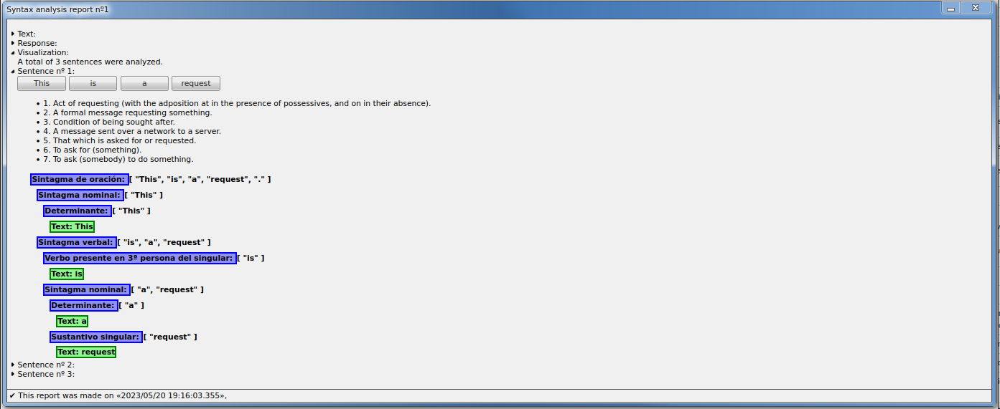

# core-nlp-by-http

Analizador gramatical para inglés vía servidor HTTP local.


## Índice

- 1. [Requisitos](#requisitos)
- 2. [Instalación](#instalación)
- 3. [Uso](#uso)
  - 3.1. [Explicación](#explicación)
  - 3.2. [Ejecución](#ejecución)
    - a) [Vía explorador](#vía-explorador)
    - b) [Vía consola](#vía-consola)
- 4. [Aplicación](#aplicación)
  - 4.1. [La interfaz gráfica](#la-interfaz-gráfica)
  - 4.2. [La visualización del análisis](#la-visualización-del-análisis)
  - 4.3. [Obtener definiciones rápidas](#obtener-definiciones-rápidas)
- 5. [Teoría gramatical](#teoría-gramatical)


## Requisitos

Necesitas tener accesible directamente desde consola estos programas:

  - `java` versión `8 o superior` (por `core-nlp`, ver más allí)
  - `node`, yo estoy usando versión `18.15.0`
  - `npm`, yo estoy usando versión `9.5.0`
  - `git`, yo estoy usando versión `2.25.1`
  - `curl`, yo estoy usando versión `7.68.0` (para parchear `core-nlp-wrapper` automáticamente)
  - `7x`, yo estoy usando versión `16.02` (para parchear `core-nlp-wrapper` automáticamente)

Mi sistema operativo es `Ubuntu 20.04.6 LTS` de `64 bits`, pero todos estos programas deberían funcionar igual para Windows u otros.

## Instalación

Este código te hará ejecutar todos los pasos directamente: descarga, instalación, linkado y ejecución. Solo asegúrate que estás en un directorio vacío.

```sh
git clone https://github.com/allnulled/core-nlp-by-http.git .
npm run up
```

El primer comando será rápido, pero el segundo, lento, porque se instalarán las dependencias de `npm` y se descargará el fichero que `core-nlp-wrapper` necesita parchear, y ambas son operaciones algo costosas.

## Uso

### Explicación

El usuario solo debería ver una página web que se le abre automáticamente cuando clica `start.sh` o `start.bat`. 

Por debajo, `java` y `node.js`, que son 2 lenguajes de programación diferentes, se tienen que comunicar entre ellos mediante el sistema operativo. Esto es porque `core-nlp` funciona con `java`, y no hay tantos proyectos que hagan lo que `core-nlp`. Nosotros levantamos un servidor con `node.js` que, mediante un subproceso del sistema operativo y ficheros temporales, va a interactuar con `core-nlp` para extraer los análisis gramaticales (en inglés) que le pidamos.


### Ejecución

#### Vía explorador

Desde el explorador de ficheros que tengas, puedes hacer doble-click en `start.sh` (Linux) o `start.bat` (Windows) para levantar el servidor.

#### Vía consola

Desde la consola, cualquiera de estas 3 líneas hace lo mismo:

```sh
npm run up                 # levanta el servidor.
./bin/core_nlp_by_http.js  # hace lo mismo.
core_nlp_by_http           # hace lo mismo. requiere previamente de `npm link`
```

Permite los parámetros siguientes:

| Parámetro | Descripción |
| --------- | ----------- |
| `--port`  | Puerto del servidor. Es `9095` por defecto |
| `--app_id` | Nombre de la aplicación. Es `Core NLP by HTTP` por defecto |
| `--browser` | Navegador para el arranque. Es `firefox` por defecto. Probará `google_chrome` también. |

## Aplicación

### La interfaz gráfica

Una vez estás dentro de la aplicación, verás algo así:


Este texto te permite interactuar con el `core-nlp` que es el que analizará el texto.

### La visualización del análisis

Cuando realizas un análisis, aparece una nueva ventanita con la información del análisis gramatical. La sección de `Visualization` es la que se ve así:


### Obtener definiciones rápidas

Para obtener las definiciones de una palabra rápidamente, solo tienes que clicar en el bóton de la palabra, bajo `Visualization`. Se mostrarán los significados encontrados en `https://api.dictionaryapi.dev/api/v2/entries/en/` de dicha palabra.



## Teoría gramatical

La teoría gramatical que subyace al parser de `core-nlp` parece que sigue una nomenclatura de clasificación de gramáticas llamada [Penn POS Tags](https://cs.nyu.edu/~grishman/jet/guide/PennPOS.html) aquí listados:

| # | Símbolo | Categoría en inglés | Categoría en castelano |
| - | --- | --- | --- |
| 1. | CC | Coordinating conjunction | Conjunción de coordinación |
| 2. | CD | Cardinal number | Número cardinal |
| 3. | DT | Determiner | Determinante |
| 4. | EX | Existential there | Existencial allí |
| 5. | FW | Foreign word | Palabra desconocida |
| 6. | IN | Preposition or subordinating conjunction | Preposición o conjunción subordinante |
| 7. | JJ | Adjective | Adjetivo |
| 8. | JJR | Adjective, comparative | Adjetivo comparativo |
| 9. | JJS | Adjective, superlative | Adjetivo superlativo |
| 10. | LS | List item marker | Marcador de elemento de lista |
| 11. | MD | Modal | Modal |
| 12. | NN | Noun, singular or mass | Sustantivo singular |
| 13. | NNS | Noun, plural | Sustantivo plural |
| 14. | NNP | Proper noun, singular | Sustantivo propio singular |
| 15. | NNPS | Proper noun, plural | Sustantivo propio plural |
| 16. | PDT | Predeterminer | Predeterminante |
| 17. | POS | Possessive ending | Final posesivo |
| 18. | PRP | Personal pronoun | Pronombre personal |
| 19. | PRP\$ | Possessive pronoun | Pronombre posesivo |
| 20. | RB | Adverb | Adverbio |
| 21. | RBR | Adverb, comparative | Adverbio comparativo |
| 22. | RBS | Adverb, superlative | Adverbio superlativo |
| 23. | RP | Particle | Partícula |
| 24. | SYM | Symbol | Símbolo |
| 25. | TO | to | Preposición «to» como «a» o «hacia» |
| 26. | UH | Interjection | Interjección |
| 27. | VB | Verb, base form | Verbo en forma base |
| 28. | VBD | Verb, past tense | Verbo en tiempo pasado |
| 29. | VBG | Verb, gerund or present participle | Verbo en gerundio o present participle |
| 30. | VBN | Verb, past participle | Verbo o past participle |
| 31. | VBP | Verb, non-3rd person singular present | Verbo presente en no-3ª persona del singular |
| 32. | VBZ | Verb, 3rd person singular present | Verbo presemte en 3ª persona del singular |
| 33. | WDT | Wh-determiner | Determinante wh |
| 34. | WP | Wh-pronoun | Pronombre wh |
| 35. | WP$ | Possessive wh-pronoun | Pronombre posesivo wh |
| 36. | WRB | Wh-adverb | Adverbio wh |


